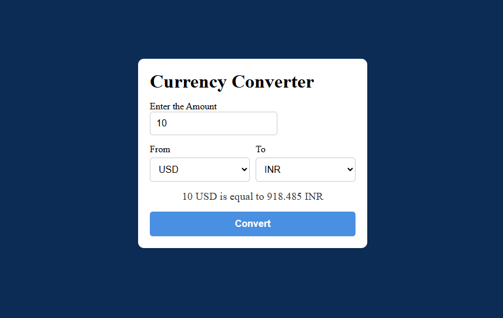

# Currency Converter 💱

A production-style currency converter built using **HTML, CSS, and vanilla JavaScript**.  
This project fetches real-time exchange rates from an external API and performs dynamic currency conversion with proper validation, error handling, and clean UI state management.

---

## ✨ Features

- Real-time currency conversion using an external API
- Dynamic currency selection
- Input validation and edge case handling
- API error handling using `try...catch`
- Clean and responsive UI
- Secure API key handling using ES modules (`import / export`)

---

## 🛠️ Tech Stack

- HTML5
- CSS3
- JavaScript (ES6+)
- Fetch API
- ES Modules

---

## 📂 Project Structure

```
├── index.html
├── style.css
├── script.js
├── config.js (ignored by Git)
├── .gitignore
└── README.md
```

---

## 🔐 API Key & Security

> **API keys are not committed to this repository.**

Sensitive configuration is handled using a separate file and excluded from version control using `.gitignore`.

### 1️⃣ Create `config.js`

Create a file named `config.js` in the project root and add your API endpoint:

```js
export const URL = "https://v6.exchangerate-api.com/v6/YOUR_API_KEY/pair";
```
The API URL is imported into the main JavaScript file using ES module syntax:

```js
import { URL } from "./config.js";
```
> ⚠️ This project uses ES modules and must be run using a local HTTP server (e.g., VS Code Live Server).

---

## 📸 Demo Screenshot



---

